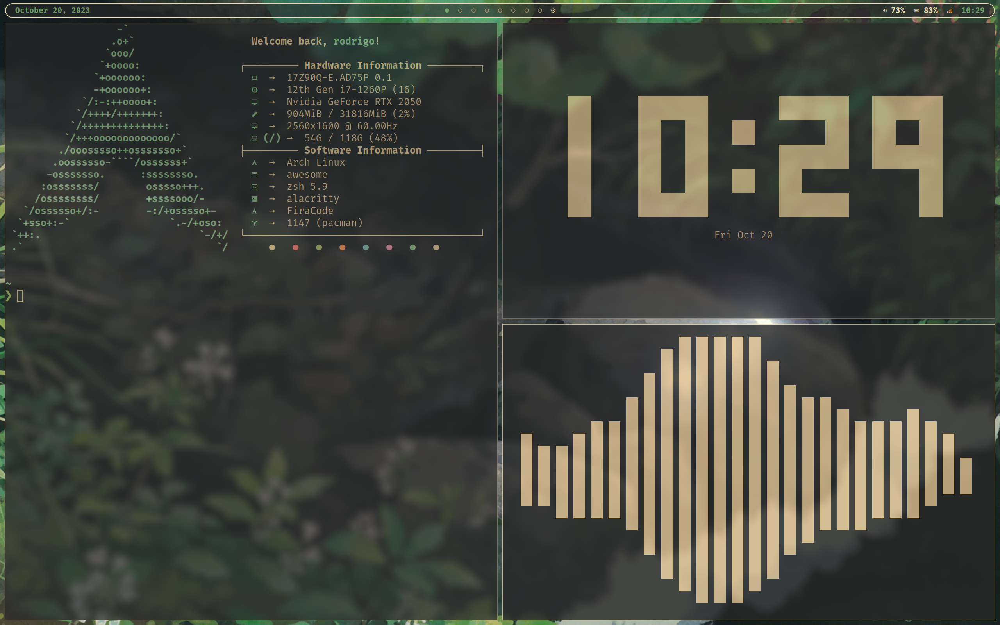
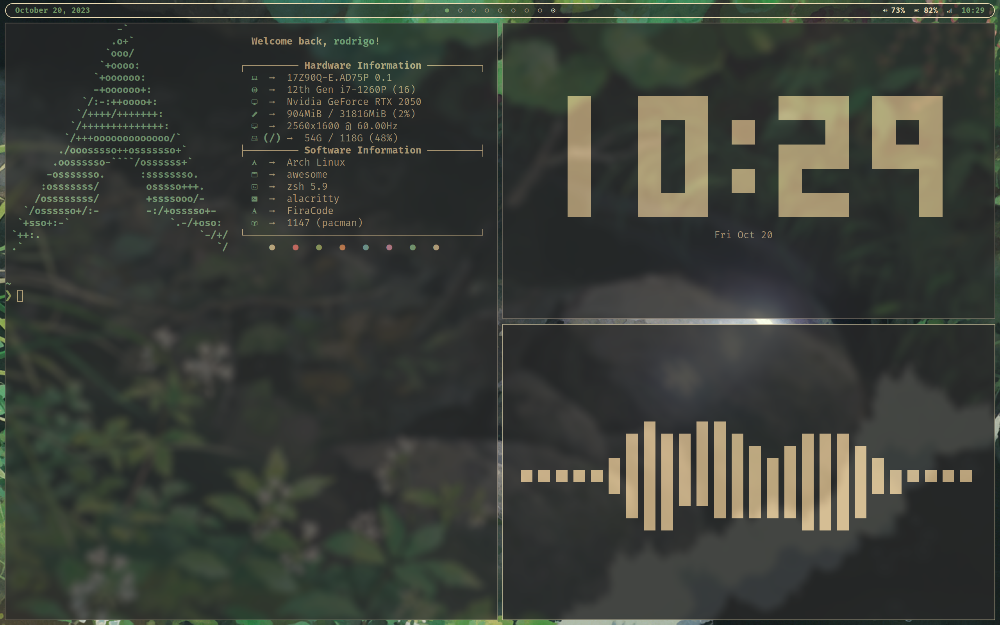
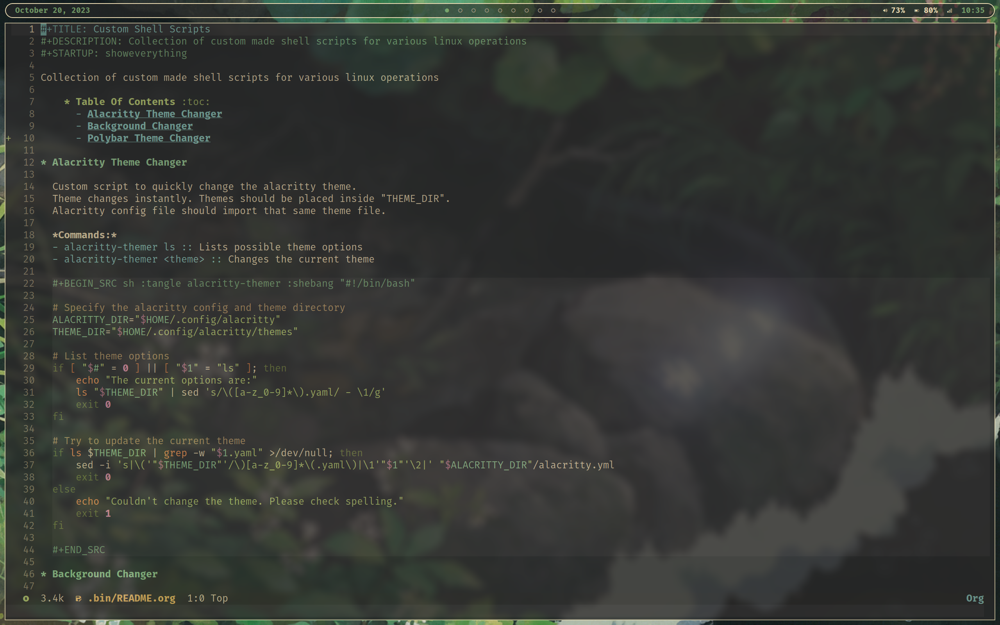

<h1 align="center">
 Dotfiles
</h1>

## Information

- OS: Arch Linux
- Terminal: Alacritty
- Shell: Zsh
- WM: AwesomeWM

---

- Bar: Polybar
- Compositor: picom
- Editors: nvim, emacs (doom), VSCode
- Browser: Firefox

---

- Fetch: Neofetch
- Prompt: Starship
- Clock: Peaclock
- Visualizer: Cava

---

## Screenshots

## Disclaimer

This repository is a just a backup for some of my config files for Arch Linux, so there may be some dotfiles I haven't uploaded or updated. Ricing/customizing Linux is a never-ending task and my setup will probably never be completely finished, therefore this is just a reference and a simple showcase of the system which I daily-drive.

I am by no means a Linux expert and this is just a simple setup I made using some applications and configurations I found and adapted from the internet. There are a lot of things I want to experiment with, so this repository will definitely change over time as I learn more and more about new stuff.

> Hope you liked my setup :)  
> Have a great day :)
